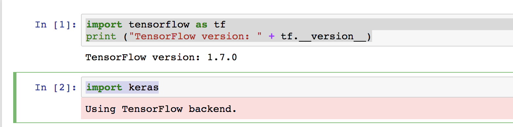

### How to set up Anaconda, Jupyter Notebook, TensorFlow and Keras

The installation setup below should take no more than 10 to 15 minutes. Read this blog post for more details: http://bit.ly/setup-for-deep-learning

Note you don't need to install Keras if you are using it as part of the core TensorFlow API. After installing TensorFlow, import tensorflow as tf, then use tf.keras.

Download Anaconda and choose Python 3.6 version: https://www.anaconda.com/download 
After downloading and installing conda, type "conda list" (and a list of packages will appear) to make sure the installation was successful. If it complains about "conda not found" then reopen your command line window. Update conda if needed. 

Set up a new conda environment, then install TF, Keras, launch Jupyter Notebook. 

```
$ conda create -n [env-name]              # create a new environment and give it a name
$ source activate [env-name]              # activate the environment you just created 
$ conda install pip                       # install pip  
$ pip install --upgrade tensorflow        # install latest version of Tensorflow 
$ pip install --upgrade pip               # if you are prompted to upgrade pip 
$ pip install --upgrade keras             # install the latest version of Keras 
$ conda install nb_conda                  # install nb_conda for easily managing/switching notebook kernel 
$ jupyter notebook                        # launch Jupyter Notebook 
```
Every time you install a package in the virtual environment, use "conda list" to verify the package is indeed installed. 
Once you are able to launch Jupyter Notebook, please create a new notebook and then execute (Shift+enter) 
the following to verify things are working:  

```
import tensorflow as tf 
print ("TensorFlow version: " + tf.__version__) 
import keras 
```
 
You should see the TensorFlow version printed and confirmation of "Using TensorFlow backend" then you are good to go. 
Otherwise, in Jupyter Notebook, click Kernel/ChangeKernel/select the kernel "fasion-mnist-tutorial". 


